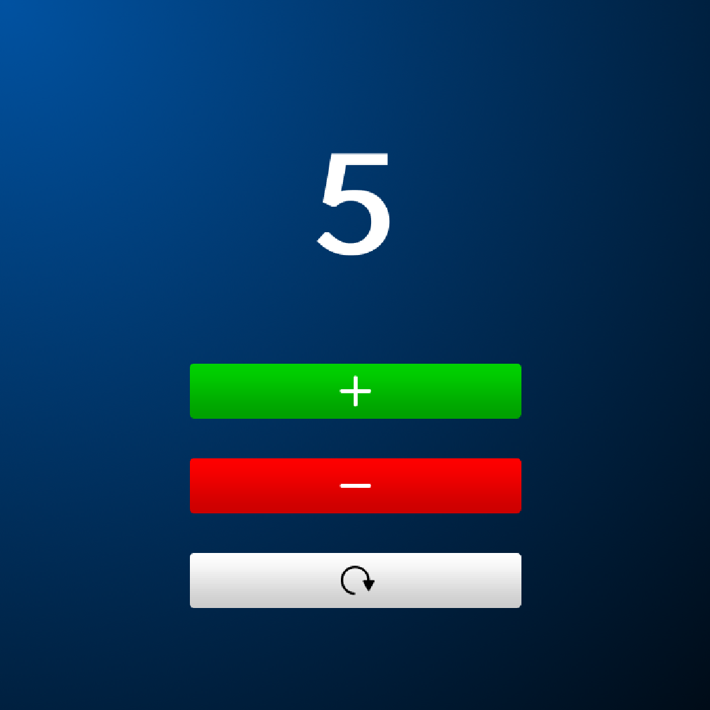

# Counter

A simple counting app made for devices running BlackBerry 10 OS.

The app has three buttons:
* Green button increments the counter by one
* Red button decrements the counter by one
* White button resets the counter to zero

# Screenshots

